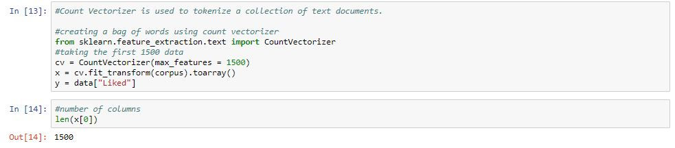

# Sentiment Analysis of Hotel Reviews
  In this project, Sentiment analysis is done with a hotel review dataset using Naive Bayes Classifiers like GaussianNB and Multinomial NB. Project's outcome includes sentiment prediction for new hotel reviews as well.
  
  Dataset : https://www.kaggle.com/akram24/restaurant-reviews
  
# Importing Libraries
  We have imported all necessary libraries for carrying out the sentiment analysis and prediction for the hotel reviews dataset. The libraries that we have imported are as follows;
  
 - pandas                 
 - numpy                  
 - count vectoeizer
 - matplotlib             
 - stopwords
 - re                     
 - porter stemmer
 - nltk 
 - naive bayes
 - seaborn
 
 # Loading the Data
 As of the dataset we have collected, we have to load/read the dataset to start working on it. For loading the specofoc data we have used the pandas library that we had imported beforehand. We have used the read_csv() and have added parameters like delimiters and quoting as the dataset is in .tsv extension.

 # Analyzing the Dataset
 For analyzing the data, we have stored the dataset into a varibale 'df' and have applied info() to check if there are some missing values. Later we have also checked whether the dataset is balanced or not, by visualizing the data using seaborn library. As we know it's always a good practice to work with balanced datas, so the check was necessary.
 
# Stemming, Tokenization and Filtering Values
For this purpose, we have imported libraries like re(regular expression), nltk(natural language tool kit), porterstemmer (For stemming). We have taken an empty corpus to start working with. We have initially considered first 1000 reviews and have filtered the values with use of re, and have limited them to only characters so that we dont encounter any numerical values.

For making it more understandable for the machine we have converted the reviews to lower case and have also applied split() to it. For every word in reviews we check if the word not in stopword, if yes then using porterstemmer, we apply stemming if no then we drop the word. The result has been stored in 'review' variable and the variable has been appended to the empty corpus.

Along with it, we have also tokenized a collection of text document using Count Vectorization, where we create a bag of words and use an initial number considering it as our max features (1500) and then we declare our dependent and independent variable x and y.

# Naive Bayes Classifier
We have splitted the dataset into train and test, with a test size of 0.2 which means we have taken 80% of the actual dataset as our training set and rest as test dataset.

Here we will be using two different methods in naive bayes, such as Gaussian Naive Bayes and Multinomial Naive Bayes and check with scores which one performs better. We are training our model with x_train and y_train fits with both the GaussianNB and MultinomialNB classifiers. Then as next step we are checking the score of these two classifiers with x_test and y_test.

As a result, we observed that MultinomialNB gave 76.5% score while GaussianNB was aroun 72.9%. So here, we will be using MultinomialNB classifier for prediction.

# Statistical Significance Test
For statistical significance test, we will be using confusion matrix and accuracy score, where we will be calculating scores for y_test and y_pred for both methods respectively.

# Pickle File
Here we will be loading the model into a pickle file, for working with some upcoming reviews as we will be taking reviews as user input and then predict the sentiment as positive or negative.

# Prediction of Sentiments
Here we take reviews as user input and predict the sentiment in form of positive and negative. In this section we followed the same procedure as before which goes as follows.

# Conclusion
In this project we worked on a hotel review dataset, taking the reviews into account we filtered the values to avoid unnecessary values that may occur in the text reviews. We then splitted our dataset into train and test datasets, followingly we basically used two classification methods of naive bayes (GaussianNB and MultinomialNB), comparing which we found that MultinomialNB is giving a better score of 76.5%. We used MultinomialNB classifier for prediction with the test data. Finally, we performed statistical significance test using accuracy score and confusion matrix to check whether the results are statistically significant or not.

The accuracy scores can be improved by using different other classifiers and hence predictional response can also improve accordingly.
